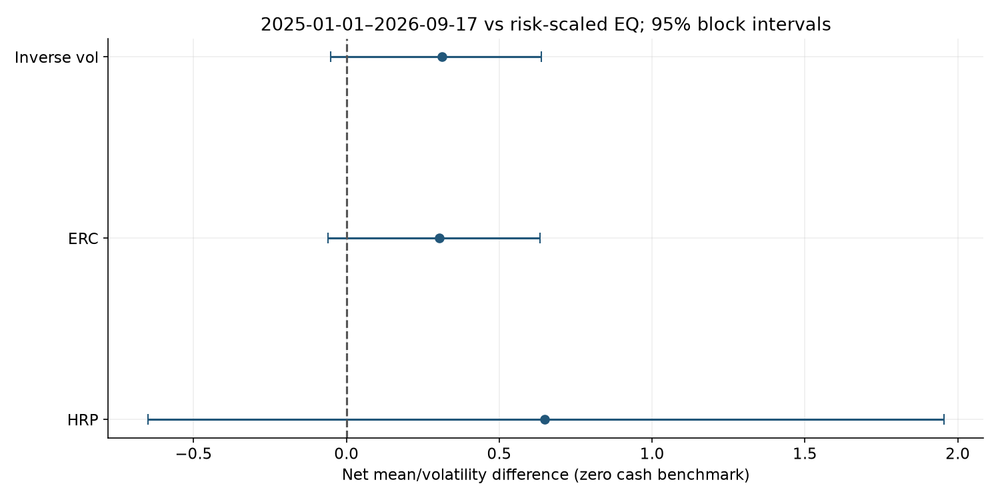

# Portfolio construction after timing, risk and costs

In January 2025–17 September 2026, HRP minus its prior-risk-scaled equal-weight control has a net annualized mean/volatility difference of **+0.649**, with paired 95% block interval **[-0.649, +1.954]**. This does not establish incremental risk-adjusted value under this universe, zero cash interest and cost assumptions.

Historical adjusted-close data are refreshed through **17 September 2026**; September is partial and the evaluation is retrospective. The contribution is a validated, inspectable comparison with explicit limitations. Original code and notebooks are preserved on branch `old`; the maintained revision is on `renovation`.

## Read the study

- [Executed notebook](study.ipynb): methods, calculations, original figures and independent checks.
- [Inputs and methods](docs/01-methods.md) → [results and implications](docs/02-results.md).
- [Audit](research/AUDIT.md), [protocol](research/PROTOCOL.md), [sources](research/SOURCES.md), [next unrun experiment](research/RESEARCH_AGENDA.md).



## Reproduce in WSL/Linux

Use Python 3.12 and the committed uv lockfile. Run from this repository:

```bash
uv sync --locked
uv run python research/acquire.py --download
uv run python -m pytest -q
uv run python research/run_study.py
uv run python research/build_notebook.py
uv run python research/check_artifacts.py
uv run python -m ruff check research tests
uv run python -m ruff format --check research tests
```

The first acquisition downloads only missing snapshots and checks pinned hashes. A revised vendor history fails clearly; restore the matching permitted cache rather than bypassing hashes. For cached/offline reproduction use `uv run --offline python research/acquire.py` followed by the remaining commands without `--download`. To import an existing permitted cache use `uv run python research/acquire.py --from-cache /path/to/cache`. An explicit later refresh uses `uv run python research/refresh_sources.py --end YYYY-MM-DD` (exclusive end, completed sessions only); retain the old manifest, amend the protocol and rerun all artifacts before changing claims.

## Repository and validation boundary

`research/` contains reusable model, data, evaluation and reporting code. Summary evidence is under `research/results/`, figures under `research/figures/`, and tests under `tests/`. Detailed empirical paths and raw snapshots are local and ignored where provider rights remain unresolved. `research/WORKLOG.md` records recovery commands and actual verification. The report is saved only after complete fresh-kernel execution.

CI runs locked setup, known-answer/timing/accounting tests and public-file checks; it does not certify market data, transaction execution or the complete historical analysis. See [publication review](PUBLICATION.md) for current-file and historical-data limits. No remote push or live publication was performed.
